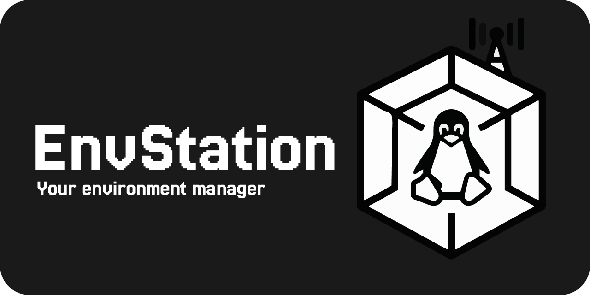

<p align="center">
  
  <br/>
  <br/>
  <sub><b>Built with the power of</b></sub><br/>
  
  
  
  
  
  <br/>
  <br/>
  <sub><b>Ready-to-use environments for</b></sub><br/>
 
  
  
  
  
  
</p>

# EnvStation

The missing Control Center for reproducible environments using [Distrobox](https://github.com/89luca89/distrobox) and [Devcontainers](https://containers.dev/).

---

## 🚀 Demo


*Creating a full Python environment and launching VS Code **in under 90 seconds** on Bazzite — UI remains fully responsive. Waiting time skipped in clip.*

---

## Introduction

**EnvStation** is a lightweight, distro-agnostic desktop application designed to solve the "split-brain" container problem on immutable Linux distributions.

On systems like Bazzite or Fedora Silverblue, the host OS is read-only. Developers are forced to use containers, typically resulting in two fragmented workflows for the same project: **DevContainers** for the IDE, and **Distrobox** for the native host terminal. Keeping these two separate environments manually in sync is tedious and error-prone.

Built with a **Rust** backend and a **React/Tauri** frontend, EnvStation acts as the intelligent bridge. It utilizes a single `.envstation.json` manifest as the absolute source of truth, effortlessly orchestrating the interplay between Distrobox and DevContainers to ensure your host terminal and IDE environment remain perfectly aligned.

For a technical deep dive into the synchronization logic, see [ARCHITECTURE.md](./ARCHITECTURE.md).

---

## Introduction

EnvStation is a lightweight, distro-agnostic desktop application designed to solve the "split-brain" container problem on immutable Linux distributions.

On systems like Bazzite, Fedora Silverblue, or SteamOS, the host operating system is read-only. Developers are forced to use containers, which in practice often leads to two fragmented workflows for the same project: **DevContainers** for the IDE and **Distrobox** for the native host terminal. Keeping these two separate environments manually in sync is tedious, time-consuming, and error-prone.

EnvStation acts as the intelligent bridge between these worlds. The application uses a single manifest (`.envstation.json`) as the "single source of truth" and orchestrates the interplay between Distrobox and DevContainers. This ensures that your host terminal and your IDE environment remain perfectly aligned at all times.

---

## Why EnvStation?

If you've ever installed a package in your native terminal, only to realize later that your IDE language server can't find it (because it's running in a different container context), you know the pain. EnvStation eliminates this friction.

### Key Benefits

#### 1. The End of "Split-Brain" Environments (Unified Parity)
Run tools like `gcc`, `python`, or `git` natively in your preferred terminal and simultaneously in your IDE, without having to configure everything twice.

<details>
<summary><b>How the synchronization works</b></summary>

> EnvStation generates an environment that serves both masters. When you open your project in VS Code, the IDE seamlessly connects to the exact same container context that powers your native host terminal via Distrobox. One container, one shared state, zero fragmentation.

</details>

#### 2. Intelligent Drift Detection
Manual terminal changes are often inevitable—but they frequently lead to "snowflake" environments that are impossible to reproduce. EnvStation gives you control back.

<details>
<summary><b>Preventing inconsistent environments</b></summary>

> EnvStation takes a snapshot of the environment immediately after its creation. If you manually install packages via the terminal, the app instantly detects that your container and your manifest (`.envstation.json`) have "drifted" apart. With a single click, EnvStation offers the solution: easily adopt those changes into your manifest to guarantee the reproducibility of your setup at any time.

</details>

#### 3. Complexity Abstracted
You shouldn't need expert knowledge in container orchestration just to set up a development environment.

<details>
<summary><b>Automating technical hurdles</b></summary>

> Manage Podman and Distrobox through a clean graphical interface. You no longer need to memorize cryptic CLI flags or complex volume mount syntax. EnvStation automatically handles difficult hurdles like **Podman GraphRoot Relocation**—a common source of errors on immutable systems. Simply choose from pre-configured templates (Python, Rust, C++, etc.) and get started in under two minutes.

</details>

#### 4. Sharing Environment Setups (EnvShare)
Share only the compact manifest (`.envstation.json`) so teammates can reproduce your exact environment within seconds.

<details>
<summary><b>The EnvShare workflow in detail</b></summary>

> * **Export a tiny manifest:** Publish the `.envstation.json` directly to a GitHub Gist and copy the generated Gist URL. Manifests contain no secrets or source code, only the configuration.
> * **Replicate in two clicks:** Import a Gist URL to save the manifest locally and start the creation process. EnvStation reconstructs the exact container, including all specific packages.
> * **Privacy-First:** Your Personal Access Token (PAT) is stored exclusively locally on your system. Since Gists are public, you share your environments deliberately and securely.

</details>

---
> **EnvStation is the control center for your development workflow.** It combines the isolation of containers with the comfort of a native OS.
---

## Key Technical Features

- Rust backend: fast and memory-safe code for background tasks.
- Rootless operation: uses user-level Podman/Distrobox so no root access is required.
- Single manifest: one .envstation.json controls synchronization between host Distrobox and DevContainer.
- Bidirectional Drift Detection: machine-readable, baseline-driven detection keeps the Distrobox container, the VS Code `devcontainer.json`, and the central manifest in sync; UI surfaces a fallback warning if a conservative query fallback is used.
- Storage helpers: tools to move Podman user storage to another location to save space on constrained disks.

---

## Supported Environments

EnvStation provides scaffolding and DevContainer sync for these ecosystems:

- Python (data science, AI, scripting)
- Node / React (frontend & fullstack)
- Rust (systems)
- Java (backend)
- C / C++ (native & embedded)
- C# (.NET, backend & desktop)

Each environment includes a starter manifest and suggested VS Code extensions. 

---

## Comparison

| Concern | Manual Distrobox / DevContainer Setup | EnvStation |
|---|---:|---|
| Repeatable setup | ad-hoc scripts and manual edits | declarative manifest + scaffolding |
| Security model | varies by setup | rootless Podman with controlled mounts |
| Drift handling | manual reconciliation | manifest-driven sync |
| Disk management | manual moves | guided storage relocation |

---

## Roadmap

- ✅ MVP (done): environment creation, manifest-based sync, storage relocation
- ✅ Drift detection and adoption flows (implemented)
- 🔜 In progress: transactional rollback for sync operations


---

## Motivation: From "Nightmare Setup" to Native Flow

EnvStation was born out of real-world friction. 

Coming from a Frontend background (React/TS), I faced a major hurdle when moving my AI research - local training of OpenCV and ResNet models - to **Bazzite**. In a prior project (Goldgrube Coin Tool) I relied on ResNet models and local toolchains; you can find that repository [here](https://github.com/Kubaguette/goldgrube-coin-tool). As an immutable distribution, the "Windows way" or even the "standard Linux way" of installing toolchains simply didn't work.

I found myself trapped in a **"Nightmare Setup"**:
- ❌ Traditional terminal Python installs failed on the read-only root.
- ❌ Fragmented Conda environments that didn't talk to VS Code properly.
- ❌ High barrier to entry for students and engineers new to immutable OSs.

**The Mission:**
I built this tool to ensure that no developer has to waste hours on environment plumbing again. EnvStation bridges the gap, providing a frictionless, native-feeling UI to manage what used to be a complex, manual process.

---
## Quick Start & Requirements

### 🛠️ Prerequisites
EnvStation relies on native container technologies. Before installing, ensure your system has:
- **Podman** (running rootless)
- **Distrobox** (for host-container integration)

<details>
<summary>💡 Need to install Podman & Distrobox? (Click to expand)</summary>

* **Fedora / RHEL:** `sudo dnf install -y podman distrobox`
* **Ubuntu / Debian:** `sudo apt install -y podman distrobox`
* **Arch Linux:** `sudo pacman -Syu podman distrobox`

**Important:** Ensure the Podman socket is enabled for your user:
```bash
systemctl --user enable --now podman.socket
```
</details>

---

### 🚀 Installation (End-User)
Grab the latest release for your distribution from the [Releases](https://github.com/Kubaguette/envstation/releases) page.

**Fedora / RHEL (.rpm)**
```bash
# Immutable Hosts (Bazzite / Silverblue / Kinoite)
sudo rpm-ostree install ./EnvStation-1.1.0-1.x86_64.rpm
systemctl reboot # Reboot required to apply OSTree deployment

# Traditional Mutable Hosts
sudo dnf install ./EnvStation-1.1.0-1.x86_64.rpm
```

**Debian / Ubuntu (.deb)**
```bash
sudo apt update
sudo apt install ./EnvStation_1.1.0_amd64.deb
```

**Arch Linux (.pkg.tar.zst)**
```bash
sudo pacman -U ./envstation-1.1.0-1-x86_64.pkg.tar.zst
```

---

### 💻 Development Mode
Since the target host OS is usually immutable, all development should occur inside a mutable container (Distrobox/Toolbox).

**1. Create / Enter your dev container:**
```bash
distrobox enter devbox
```

**2. Install native dependencies (inside the container):**
Depending on your container's base image, install the required Tauri dependencies:
* **Fedora:** `sudo dnf install -y webkit2gtk4.1-devel libappindicator-gtk3-devel librsvg2-devel gtk3-devel gcc gcc-c++ make xdg-utils`
* **Ubuntu/Debian:** `sudo apt install -y libwebkit2gtk-4.0-dev libappindicator3-dev librsvg2-dev libgtk-3-dev build-essential xdg-utils`
* **Arch:** `sudo pacman -Syu webkit2gtk libappindicator-gtk3 librsvg gtk3 base-devel xdg-utils`

**3. Clone & Run:**
```bash
git clone [https://github.com/Kubaguette/envstation.git](https://github.com/Kubaguette/envstation.git)
cd envstation
npm install
npm run tauri dev
```
---
## Contributing

We welcome contributions that respect the project's architecture and testing boundaries. Please consult ARCHITECTURE.md before making large structural changes; follow the Core → Commands → View separation and prefer small, reviewable PRs.

---

## Author

**Kubaguette**
*Frontend Engineer | Exploring Rust & Linux Systems*

- 🐙 [GitHub Profile](https://github.com/Kubaguette)
- 💰 Inspiration: [Goldgrube Coin Tool](https://github.com/Kubaguette/goldgrube-coin-tool)

---

## License

EnvStation is distributed under the GNU General Public License v3.0. See LICENSE for details.

---

Built by developers, for the Bazzite and whole Linux community. Aiming for native, frictionless engineering.
